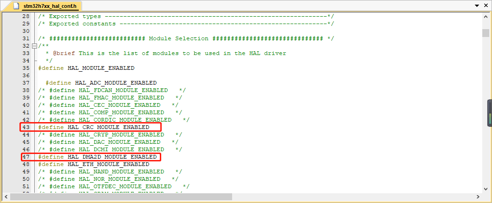
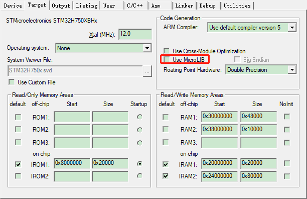
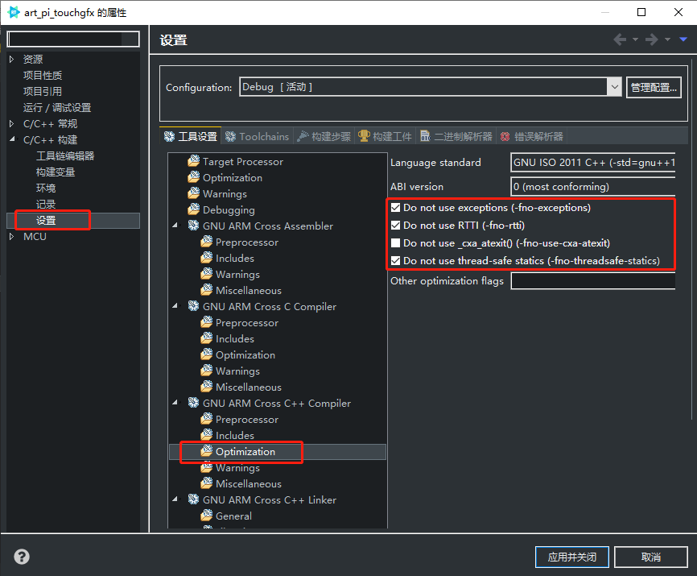
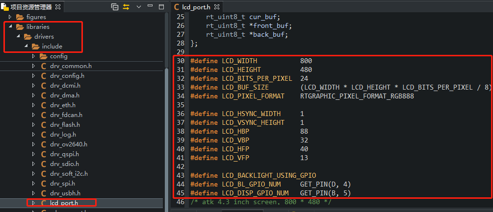
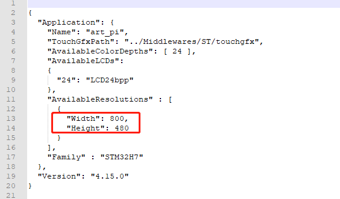
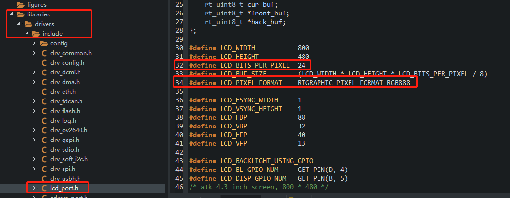
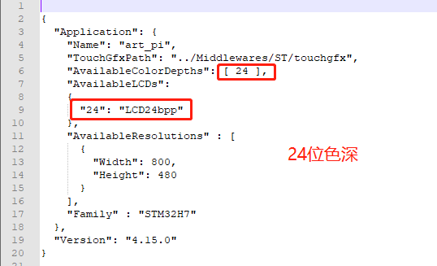
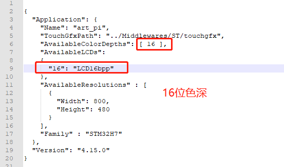
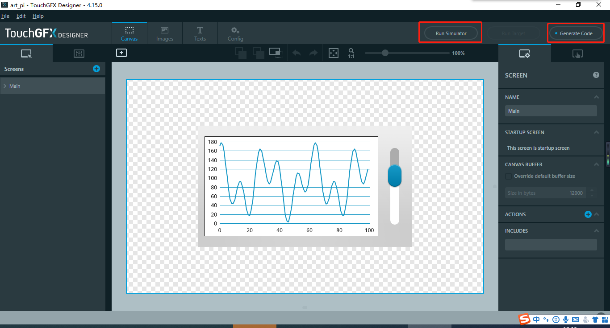
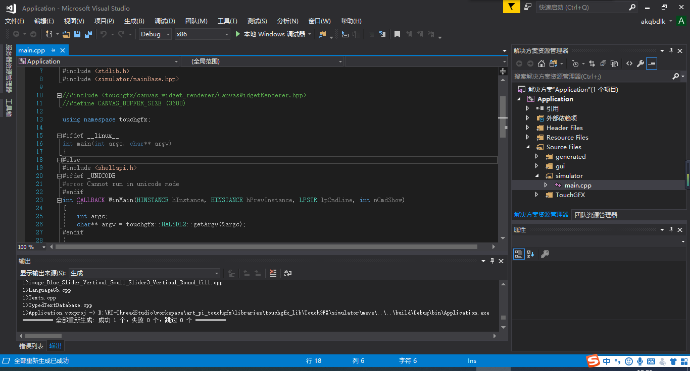

# TouchGFX

## 1、介绍

TouchGFX是一个基于STM32硬件由C++写成的软件框架，使用 ST 芯片的用户可以免费使用 touchgfx。

touchgfx的官方文档：[https://support.touchgfx.com/docs/introduction/welcome](https://support.touchgfx.com/docs/introduction/welcome)。

### 1.1 目录结构

| 名称        | 说明                                       |
| ----------- | ------------------------------------------ |
| port        | lcd驱动实现的例子，替换掉rtthread的lcd驱动 |
| docs        | 文档目录                                   |
| examples    | 例子目录，启动touchgfx任务                 |
| Middlewares | touchgfx库文件                             |
| TouchGFX    | touchgfx UI源文件                          |

### 1.2 许可证

touchgfx2rtt package 遵循 LGPLv2.1 许可，详见 `LICENSE` 文件。

### 1.3 依赖

- RT-Thread 4.0+
- C++

## 2.如何使用

**2.1 使用 touchgfx2rtt package 需要在 RT-Thread 的包管理器中选择它，具体路径如下 **

```
RT-Thread online packages
    multimedia packages --->
     [*] touchgfx : a touchgfx package for rt-thread.
```

 然后让 RT-Thread 的包管理器自动更新，或者使用 `pkgs --update` 命令更新包到 BSP 中。 

**检查工程中是否开启了C++支持和SDRAM、LCD的驱动，如果没有，请手动开启**

**2.2 在工程中打开DMA2D和CRC外设**

  

**2.3 如果使用mdk开发，Micro LIB库不要打勾，Micro LIB库不支持C++**



**2.4 如果使用studio开发，需要开启libc库，并注意需要配置C++编译规则**



**2.5 设计UI**

在TouchGFX 文件夹中找到ApplicationTemplate.touchgfx.part，使用TouchGFX 4.15.0 Designer打开，开始进行UI设计。设计完UI后，记得更新工程。

## 3. 注意事项

**当前版本的软件包只支持STM32F4xx STM32F7xx STM32H7xx  三款类型的芯片，和RGB接口的LCD。**

**3.1 如何更换屏幕**

更换屏幕后，只需要修改对应的屏幕参数即可。



用文本文档打开ApplicationTemplate.touchgfx.part，调整分辨率



修改好，双击打开，重新生成UI工程。

**3.2 如何更改色深**

默认只支持RGB888 24位色深和RGB565 16位色深，只需要修改LCD_BITS_PER_PIXEL和LCD_PIXEL_FORMAT这两个宏，


用文本文档打开ApplicationTemplate.touchgfx.part，调整色深





修改好，双击打开，重新生成UI工程。

## 4. UI开发及仿真

**4.1 使用TouchGFX 4.15.0 Designer 仿真**

打开ApplicationTemplate.touchgfx.part，导入例程，或者自己设计UI界面，使用TouchGFX 4.15.0 Designer 即可仿真运行




**4.2 使用Visual Studio 仿真**

在TouchGFX文件夹下找到simulator，打开Application.sln，可以使用Visual Studio设计UI和仿真运行


在TouchGFX Designer设计完UI，刷新工程，即可将UI更新到项目中。

## 5、联系方式 & 感谢

- 维护：kk

- 主页：[https://gitee.com/Aladdin-Wang/touchgfx2rtt](https://gitee.com/Aladdin-Wang/touchgfx2rtt)

- 邮箱：[1335809282@qq.com](1335809282@qq.com)

  

更多关于Touchgfx的教程请关注公众号，或者博客https://blog.csdn.net/sinat_31039061

